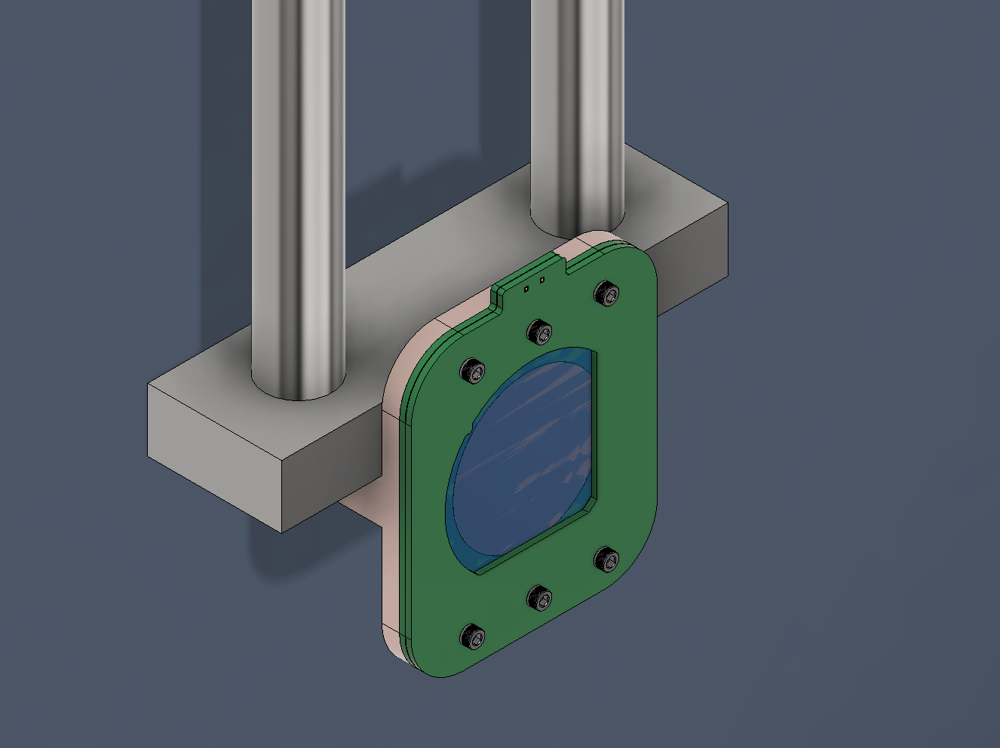
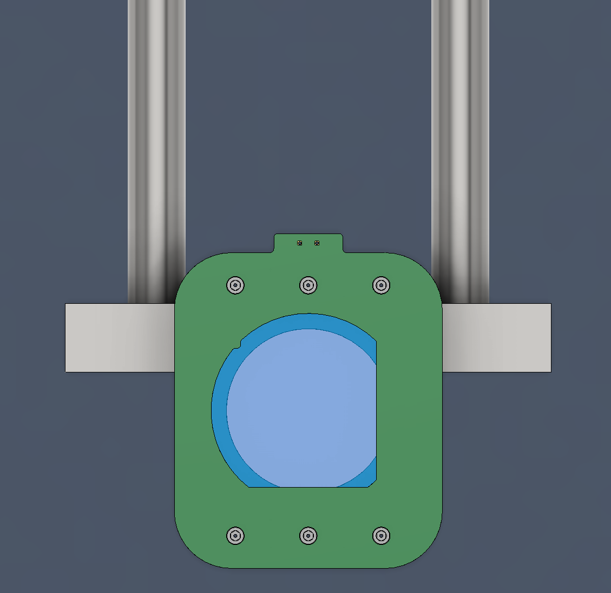
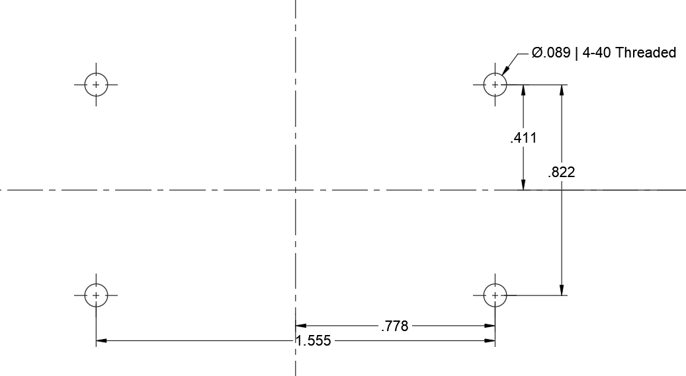
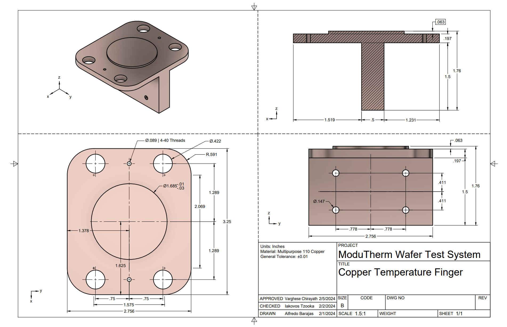
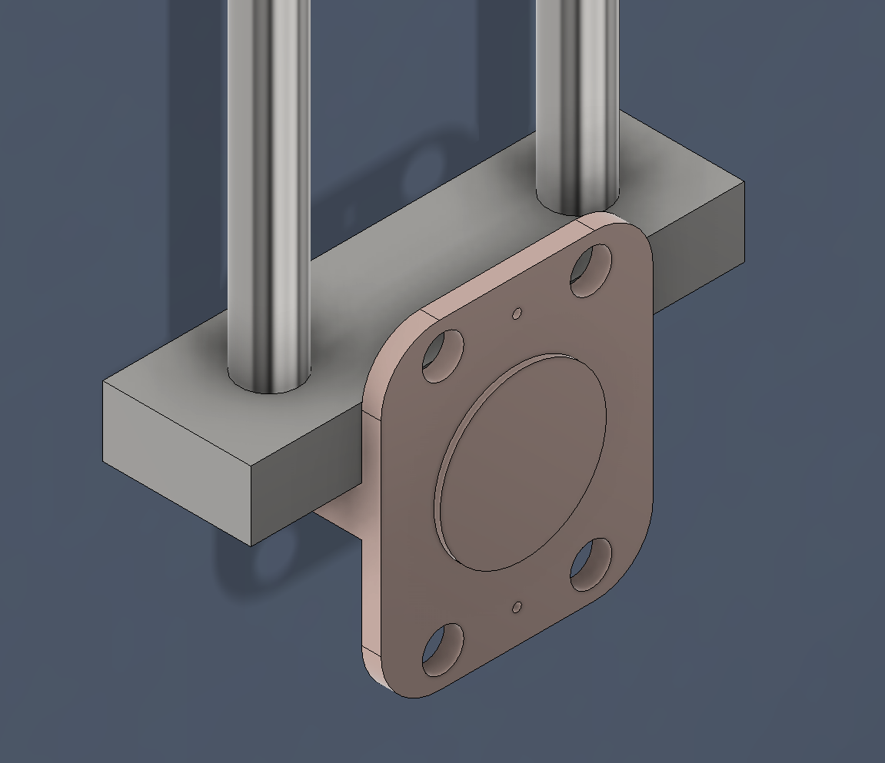
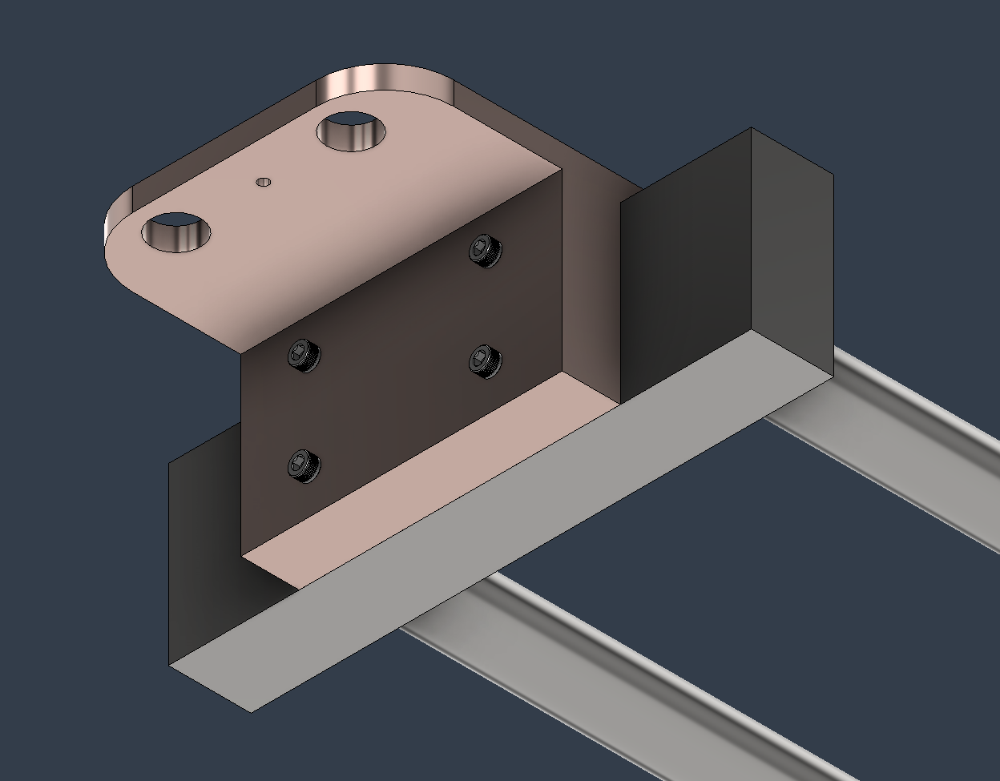
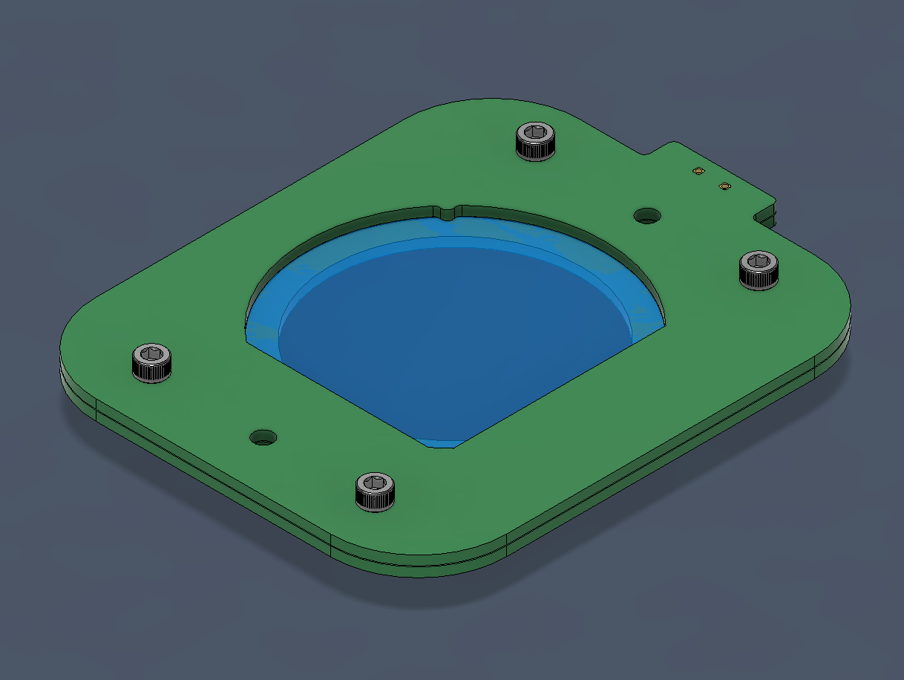

 University of Texas at Arlington  
===
___

## ModuTherm Wafer Test System  
The ModuTherm Wafer Test System is designed to support the testing of 2-inch (50.8 mm) diameter silica/quartz wafers within a testing chamber. This system includes three main components: a Thermal Regulation System, a Temperature Stabilization Probe, and a Probe Card. These components are designed for easy replacement or modification to accommodate various testing needs.

The design focuses on providing a customizable and user-friendly experience, allowing for adjustments to suit specific testing requirements. The modular nature of the system aims to facilitate the testing process for custom silica/quartz wafers, catering to the needs of researchers and professionals looking for a functional and adaptable testing solution.
___
  
## Table of Contents  
- [Assets]  
  - [ Intended Connection ]  
  - [ Copper Temperature Stabilization Probe ]  
  - [ PCB Probe Card ]  
- [ Simulation Example ]  
- [ Aknowledgements ]
___

**Recommended Screws**  
6 ::: 93235A107_Vented Socket Head Screw   
4 ::: 93235A114_Vented Socket Head Screw  
4 ::: 91240A005_Mil. Spec. 18-8 Stainless Steel Hex Nut  

## :: Assets ::  

### :: Intended Connection ::  

The **Temperature Stabilization Probe** is designed for compatibility with thermal regulation systems that match the hole and thread dimensions shown in the previous image. It is important to consider the placement of nuts and threads for mounting the PCB Probe card, as well as the arrangement of the contacting faces. This ensures the probe can be mounted into any thermal regulation system with the specified dimensions
  
### :: Copper Temperature Stabilization Probe ::  
  
  
The **Copper Temperature Stabilization Probe** is designed with a contact diameter of 1.685 inches (42.8 mm), ensuring adequate contact within the central region of a wafer substrate. The contact point is elevated by approximately 0.063 inches (1.6 mm) to ensure that a PCB probe card, detailed later in the documentation, aligns perfectly flush with the surface. Users have the flexibility to select a thermal paste that best suits their requirements to enhance surface contact between the probe and the wafer.  

For a comprehensive understanding of the design, a preliminary drawing is available in the preceding image. Additionally, for detailed examination and utilization, a PDF of the drawing, along with STL and STEP files, are provided in the folder named "1. Copper Temperature Stabilization Probe" within this repository.  

  

### :: PCB Probe Card ::  

The design of the probe card prioritizes affordability and versatility, enabling customization to accommodate various wafer configurations. It facilitates external mounting assembly, utilizing four screws to secure the substrate effectively. The arrangement includes two central holes for mounting purposes, while the peripheral holes are strategically placed to align the wafer, ensuring precise testing.  

## Simulation Example

## Aknowledgements

:: **Simulation and Feedback** ::  
Iakovos Tzoka  
https://www.linkedin.com/in/iakovos-tzoka-401207224  
  
:: **Supervision** ::   
Dr. Varghese Chirayath  
https://www.uta.edu/academics/faculty/profile?username=chirayat  
