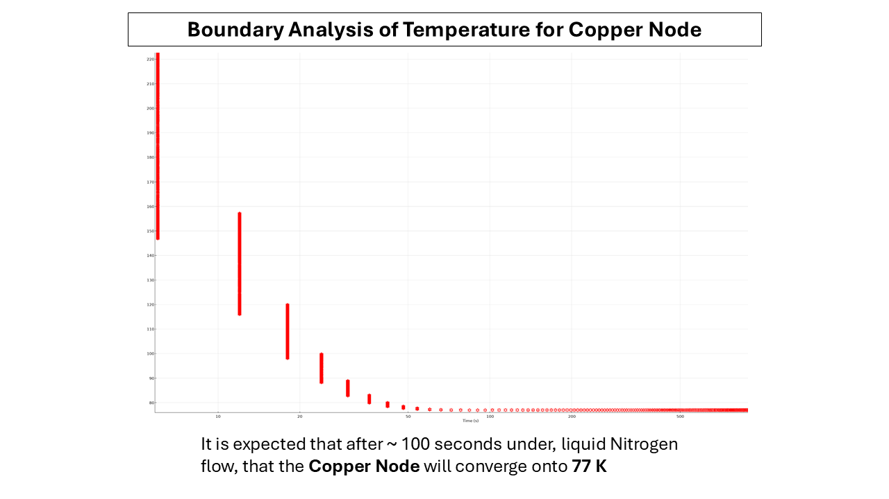

## :: Screws and Nuts Used [McMasterr](https://www.mcmaster.com/) ::  
| Quantity | Item Number   | Description                                  |
|----------|---------------|----------------------------------------------|
| 6        | 93235A107     | Vented Socket Head Screw                     |
| 4        | 93235A114     | Vented Socket Head Screw                     |
| 4        | 91240A005     | Mil. Spec. 18-8 Stainless Steel Hex Nut      |

| Feature       | Information                                                                                                                        |
|---------------|------------------------------------------------------------------------------------------------------------------------------------|
| Dimensions    | x-70 mm y-87.55 mm                                                                                                                 |
| Thickness     | 1.6 mm                                                                                                                             |
 
## Aknowledgements

:: **Simulation and Feedback** ::  
Iakovos Tzoka  
https://www.linkedin.com/in/iakovos-tzoka-401207224  
  
:: **Supervision** ::   
Dr. Varghese Chirayath  
https://www.uta.edu/academics/faculty/profile?username=chirayat  
